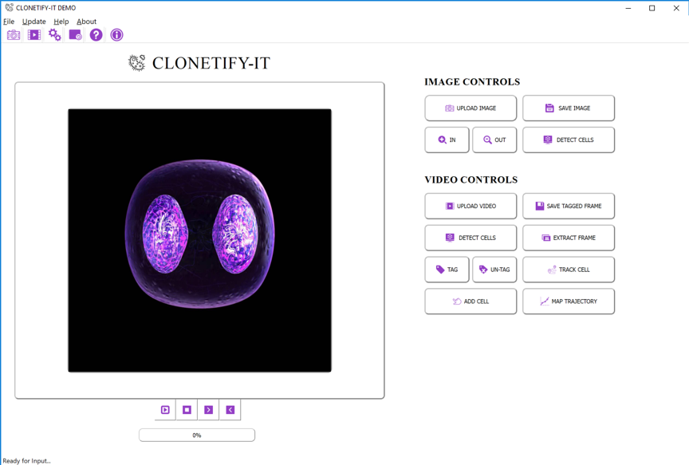

# CLONETIFY-IT

## Created by Mayra Banuelos @TalesOfDNA
#### Research Assistant at Brown University
#### Post-Bac Researcher at San Francisco State University

   Sample videos and images are provided.

### Install Python Libraries
You can run this python script from terminal but you will need the following libraries: 
  - PyQt4
  - Numpy
  - Matplotlib
  - Scipy 
  - OpenCV
  - NdImage
  - Imutils 

### Running the Program

From Terminal: python Gui2A.py 

### Main Interface 

