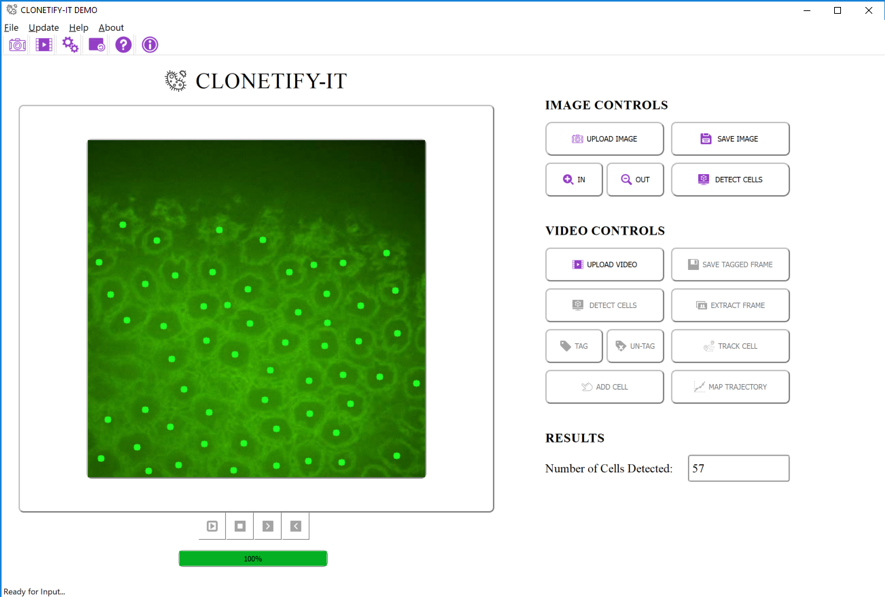
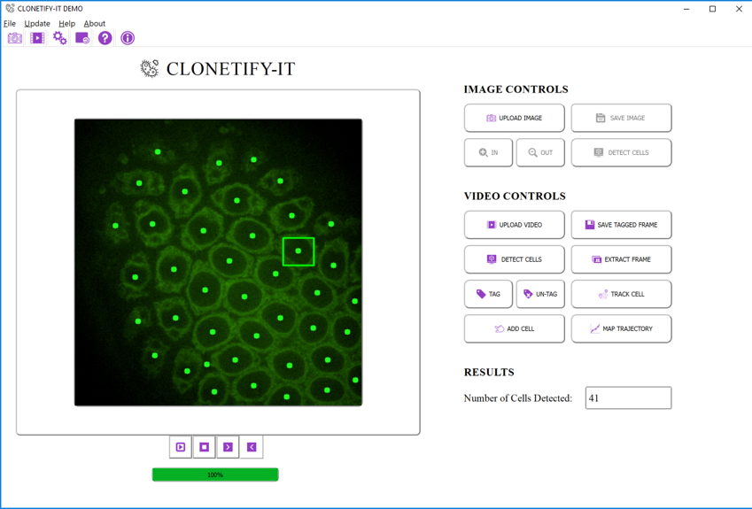
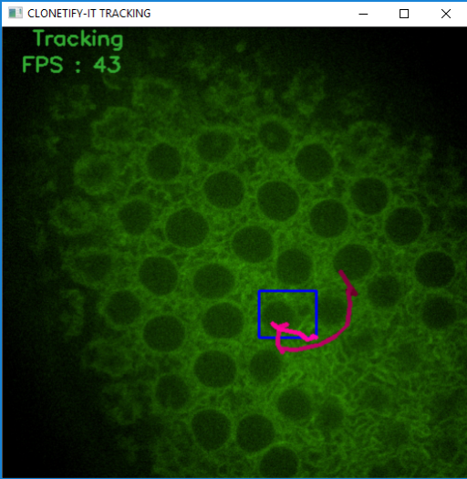
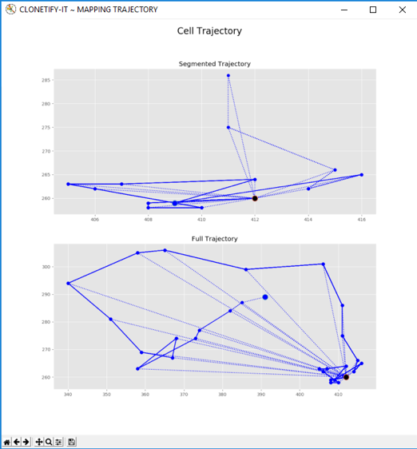

# CLONETIFY-IT

## Created by Mayra Banuelos @TalesOfDNA.  

### *Research Assistant at Brown University and Post-Bac Researcher at San Francisco State University.* 

## Introduction
This program was created using Python 2.7 and the PyQt4 Library for user interface. Since Python 2.7 will soon stop being maintained, I am currently working on translating the code to Python 3 and PyQt5.

## Install Python Libraries.
You can run this python script from terminal but you will need to install the following libraries: 
  - PyQt4
  - Numpy
  - Matplotlib
  - Scipy 
  - OpenCV
  - NdImage
  - Imutils 

## Running the Program
From Terminal: python Gui2A.py. Sample videos and images are provided.

## User Interface 

## Cell Counting with Low Resolution Images

      
## Cell Counting in HD Video      

## Cell Detection and Tagging     

     
## Cell Trajectory Tracking in Video     
     
      
## Trajectory Mapping     
  
